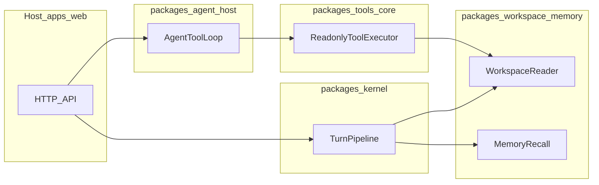

# Agent 能力对标与分阶段实现 PLAN

本文档为仓库内可执行路线图；验收勾选见 [plan-agent-parity-checklist.md](plan-agent-parity-checklist.md)。

## 目标与范围

- **目标**：在「本地编码助手」维度具备 **Claude Code 级核心能力**（工具闭环、可观测、可扩展），并在 [project-conventions.md](project-conventions.md) 所要求的**简洁、单职责、可审计**前提下，追求**优于对标的结构与性能**（更少无效层、更清晰边界），而非 UI 像素级复刻。
- **参考策略（三主轴 + 多源）**：
  1. **产品/协议叙述**：`参考/hermes-agent-main/website/docs/user-guide/` 下专题 MD。
  2. **TS 侧行为与模块划分**：`参考/claude-code-backup/` — 理解分层、热路径与错误模型；实现须 **clean-room（自写）**，禁止为「规避」叠双轨适配器或无意义防腐层；许可存疑时以 **Hermes 文档 + claw PARITY + 最短自写路径** 定案。
  3. **差距清单与多语言对照**：`参考/claw-code-main/` — `PARITY.md`、`rust/crates/{api,tools,runtime}` 作阶段与验收模板。
  4. **其余 `参考/` 目录**：见 [reference-notes.md](reference-notes.md) 登记表。

- **工程约束**：单文件单职责、无创世文件、可替换宿主；新能力经 **新端口 + 新包**；`apps/web/server.ts` 薄装配；[DESIGN.md](../apps/web/DESIGN.md) 与界面不写栈名/架构句。

## 优先级（执行顺序哲学）

1. **高效与结构优美**：热路径少分配、少反射、少中间层；工具循环遵守「请求路径不重复全文扫描」精神（见 project-conventions 性能节）。
2. **简洁**：能用一个端口说清楚的不拆三个包。
3. **风险与合规**：在 1、2 满足后，以**同一路径上的轻量策略**加权限校验与可选审计；禁止仅为「显得安全」而叠重复网关。

## 反模式（明确禁止）

- **规避式冗余**：为合规心理安慰增加重复包装、双轨接口、空转 adapter。
- **风险优先倒置**：tool 循环尚未清晰前先上大安全中台。
- **破坏 conventions**：领域逻辑塞进 `server.ts`、单文件「小创世」。

## 与 project-conventions 对齐声明

本路线图新增代码须通过 [convention-compliance.md](convention-compliance.md)；包划分见下文矩阵「拟落点」列；不在前端展示实现细节。

## 能力定义（Claude Code 级可验收）

下列条目用于判断「是否达到对标能力面」，**不要求**首版全部自动化到 Hermes 全量特性：

1. **工具闭环**：模型可发起结构化 tool 调用，宿主执行只读工具并写回结果，直至模型输出终稿或达到轮次/预算上限。
2. **沙箱与策略**：工作区路径受根目录约束；敏感路径单次策略拒绝；错误可 JSON 化、不拖垮进程。
3. **可观测**：可选 JSONL 审计（与 memory 事件同文件机制、区分 `kind`）。
4. **可扩展端口**：MCP、Hooks、Skills、委托等以接口占位，可替换实现而不改编排内核签名。
5. **显式预算**：tool 轮次上限、每轮 `max_tokens`、HTTP 超时由**数据结构 + 环境变量**配置（见 `@mind/agent-contract` 的 `agentCompletionBudgetFromEnv`）。

## 参考源登记表（`参考/` 顶级目录）

| 目录名 | 建议对照用途 |
|--------|----------------|
| `claude-code-backup` | TS：工具池、token 预算、终端/权限等模块边界（只读研究，不拷贝实现） |
| `claw-code-main` | Python + Rust：`PARITY.md`；`rust/crates/*` 分层 |
| `hermes-agent-main` | 文档：delegation、MCP、hooks、skills、routing、security |
| `awesome-design-md-main` | 设计素材；不进运行时 |
| `fireworks-tech-graph-main` | 图/结构化知识；扩展时评估 |
| `gbrain-master` | 图记忆参考；与神经形态端口远期相关 |
| `glass-main` | UI 参考；与 DESIGN 冲突时以 DESIGN 为准 |
| `khoj-master` | 本地 RAG；与 `@mind/memory` 对照 |
| `logseq-master` / `Trilium-main` / `trilium-translation-main` | 双链笔记；与 memory 协议长期相关 |
| `quivr-main` | RAG/聊天栈参考 |
| `Second-Me-master` | 数字孪生；远期 |
| `supermemory-main` | 记忆 API 形态参考 |
| `superpowers-main` | 技能编排；与 Hermes skills 交叉 |

## 能力矩阵（本仓库现状 / 目标行为 / 三主轴参考 / 落点）

| 能力域 | 本仓库现状 | 目标行为 | Hermes 参考 | TS 参考（claude-code-backup） | claw-code-main | 拟落点包/端口 |
|--------|------------|----------|-------------|-------------------------------|-----------------|----------------|
| 工具协议与沙箱 | `@mind/tools-core` 内置只读三工具 + `DefaultToolPolicy` | 可审计 tool 调用、错误 JSON、无第二调用栈 | `features/tools.md`, `code-execution.md`, `security.md` | `toolPool.ts`, `toolErrors.ts`, `timeouts.ts` | `PARITY.md` tools/；`rust/crates/tools` | `@mind/tools-core`；`ToolPolicyPort` |
| Token / 预算 | `agentCompletionBudgetFromEnv` + `openAiToolChatCompletion` 传 `max_tokens` / 超时 | 显式上限、可配置 | `context-files.md` | `tokenBudget.ts`, `tokens.ts` | `rust/crates/runtime` | `@mind/agent-contract`；`@mind/adapters-llm` |
| 终端与执行 | 未实现任意 shell | 受控执行或继续缺席 | `code-execution.md` | `terminal.ts` | PARITY shell | 首版不做 |
| MCP | `NoopMcpHost` | 可插拔远程工具表 | `mcp.md` | `src` 内 MCP 结构 | PARITY MCP | `McpHostPort` |
| Hooks | `NoopHookRegistry` | 前后置可注入 | `hooks.md` | toolHooks 路径 | PARITY hooks | `HookRegistryPort` |
| Skills / 剖面 | `EnvSkillRegistry` + `MIND_AGENT_SKILL_FILES` | 可装载短片段 | `skills.md`, `profiles.md` | skill/telemetry util | PARITY skills | `SkillRegistryPort` |
| 会话与状态 | 对话仍 `SessionStore`；agent 回合无状态或客户端传 `history` | 与 sessions 文档对齐的持久化可后续加 | `sessions.md` | session util | Python `src/assistant` | `@mind/memory`；`POST` body `history` |
| Git / 工作树 | 未接 | 安全协作 | `git-worktrees.md` | `worktree.ts` | rust workspace | 远期 |
| 路由与降级 | `createLlmFromEnv` / `createOpenAiCompatConfigFromEnv` | 多模型与降级 | `provider-routing.md`, `fallback-providers.md` | workload util | `rust/crates/api` | `@mind/adapters-llm` |
| 记忆与上下文 | `@mind/memory` 协议 + 检索 | 与 memory 文档一致 | `memory.md`, `context-files.md` | 低优先 | `bootstrap_graph.py` | `@mind/memory` |

## 与现有架构衔接

- **对话**：`MIND_CHAT_DELIVERY=unified_agent` 时 `POST /api/chat`（JSON）与 `POST /api/chat/stream`（SSE）走 **`AgentToolLoop`**；`memory_pipeline` 时走 **`TurnPipeline`**（`/api/chat` JSON；`/api/chat/stream` 将整段答复切分为 `delta`）。统一流式事件的 `reasoning` / `done.reasoning` 见 [runtime-and-data-flow.md](runtime-and-data-flow.md)。
- **带工具编码回合**：`AgentToolLoop`（`/api/agent/turn`），只读工具经 `WorkspaceReader`。

## 分阶段路线（与 PARITY / Hermes 对齐说明）

- **Phase A**：`@mind/agent-contract` — 类型与 `agentCompletionBudgetFromEnv`；单测。对照 **PARITY**「core tool loop」最小面 + OpenAI tool schema 子集。
- **Phase B**：`@mind/tools-core` + `@mind/agent-host` + `openAiToolChatCompletion`；`POST /api/agent/turn`。对照 **claw** `rust/crates/tools` MVP 与 **TS backup** 工具族职责划分（非拷贝代码）。
- **Phase C**：`DefaultToolPolicy` + `MIND_AGENT_EVENTS`。对照 Hermes **`security.md`** 与 TS 权限**思路**；[convention-compliance.md](convention-compliance.md)。
- **Phase D**：`NoopMcpHost`。对照 PARITY **MCP** 段 + Hermes **`mcp.md`**。
- **Phase E**：`NoopHookRegistry` / `EnvSkillRegistry`。对照 PARITY **hooks/skills** 缺口章节 + Hermes **`hooks.md` / `skills.md`**。
- **Phase F**：`NoopDelegation`。对照 Hermes **`delegation.md`**；真委托后续迭代。

## HTTP 摘要（本地）

| 方法路径 | Body 要点 | 响应要点 |
|----------|-----------|----------|
| `POST /api/chat/stream` | `sessionId`、`text`（`unified_agent` 时） | SSE：`prefetch`、`reasoning`（可选）、`delta`、`done`（可含 `reasoning`）；详见 [runtime-and-data-flow.md](runtime-and-data-flow.md) |
| `POST /api/agent/turn` | `text`（必填）；`history`（可选，role 为 `user` \| `assistant` \| `system`） | `assistant`；`toolRounds` |

环境变量见 `apps/web/.env.example`：`MIND_AGENT_*`、`MIND_AGENT_EVENTS`、`MIND_AGENT_SKILL_FILES`、`MIND_AGENT_OPENAI_TIMEOUT_MS`、`MIND_AGENT_MAX_TOKENS`、`MIND_AGENT_MAX_TOKENS_FINAL`。

## 风险、不做清单与许可（次于高效与简洁）

- **预算**：轮次、`max_tokens`、HTTP 超时由 `agentCompletionBudgetFromEnv` 与路由装配注入 `AgentToolLoop`（数据结构 + 单次检查）。
- **不做**：首版无沙箱 shell、默认无写盘工具。
- **许可**：`claude-code-backup` 仅作研究；实现最短自写 + 文档说明来源。
